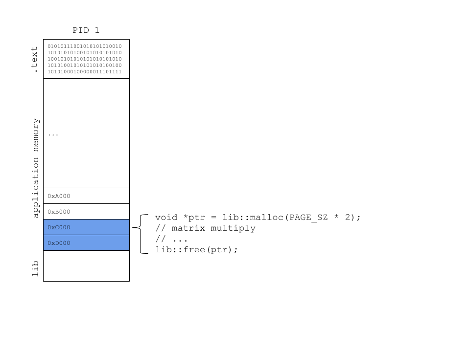
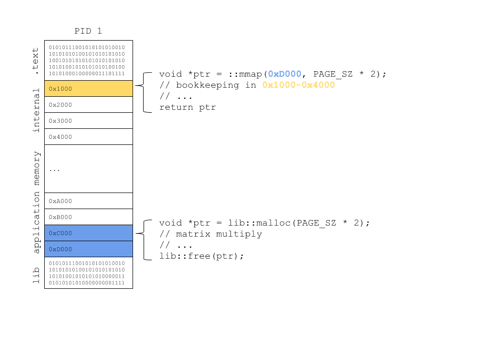
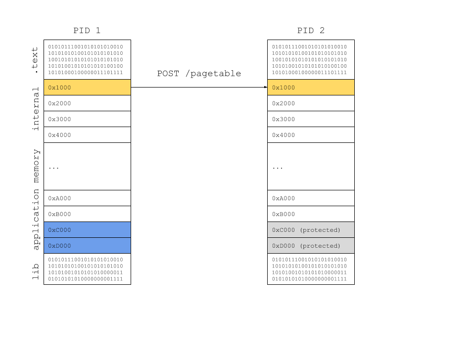
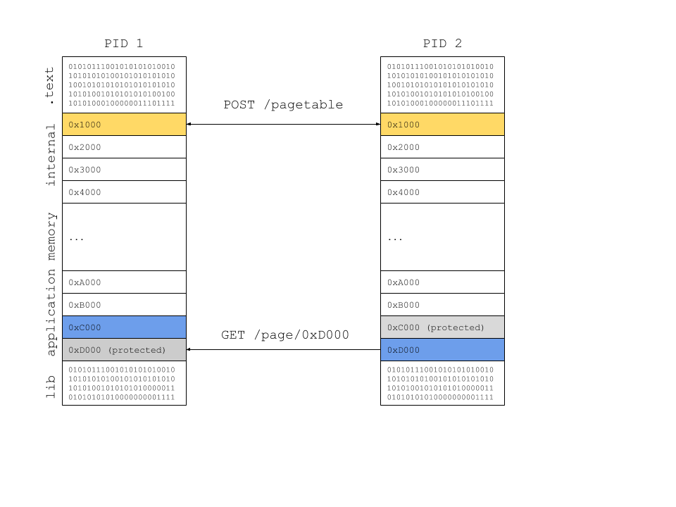

# gallocy

## memory allocation

Most non-trivial applications will need to use memory at some point or another.
When they need memory, they use an allocator; either one provided by the system
library or a custom one of their choosing.

### a system allocator

The predominant memory allocator used by most applications is `malloc`. A
program that uses `malloc` allocates memory in a process's address space, and
it might look something like the following diagram.

This allocator allocated memory using `mmap(2)` or `sbrk(2)` or some other
primitive system call and placed, as depicted, this memory at address `0xD000`
through `0xB000` (that's two 4096 byte pages). This allocator is keeping track
of the memory it allocated some way opaque to you and I, but rest assured, it
is accounted for somewhere in the system library.

### a custom allocator

Let's assume that we know how to create a custom allocator that provides the
same call interface and semantics as the system allocator. We'll cover how you
can design one of these allocators in another document.

Our custom allocator will use `mmap(2)` or `sbrk(2)` or some other primitive
system call, too, and it'll place memory in the same region, but it'll do a
little more. Our memory allocator will maintain allocation metadata in a
private internal memory region that the allocator itself (remember, this is
just code that lives in the depicted `lib` section) at address `0x1000`.

This private internal memory region might have a few simple data structures
that let us maintain a pointer to the memory that we allocated, how big the
allocation was, the memory protections, and more. The possibilities are
endless.

#### a networked custom allocator

Depending on the type of metadata that we maintain in the private internal
memory, we could tell *another process* about our private internal metata.
Let's call this private internal metadata a page table.

Using this memory allocator, when an application asks for memory, the memory
allocator tells other processes about the allocation before returning the
memory to the application. The other processes can map the same memory into
their address space. Because memory consistency is probably important for
maintaining correctness, the remote process should protect this memory by not
allowing read or write access to the newly allocated region.

If and when the remote process might actually want to read or write the
protected memory region, it'll fault, because the remote memory allocator
protected this memory.

However, upon access, the remote memory allocator *does* know who does have the
requested memory and can issue a request to have *access* to the memory region.
In doing so, the processes can negotiate who has access to the page, copy over
the latest contents of the memory region, and lastly, update each's local page
table and set memory protections accordingly.

This is a distributed shared memory allocator.
